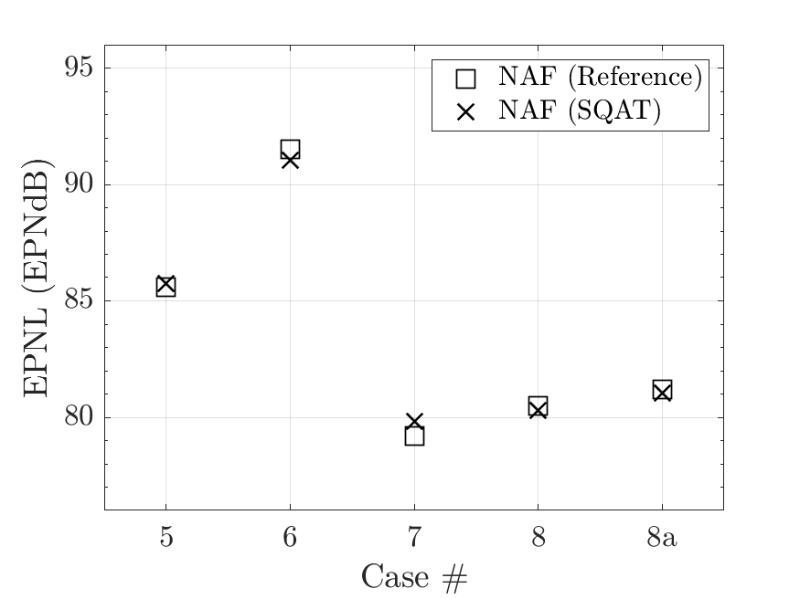
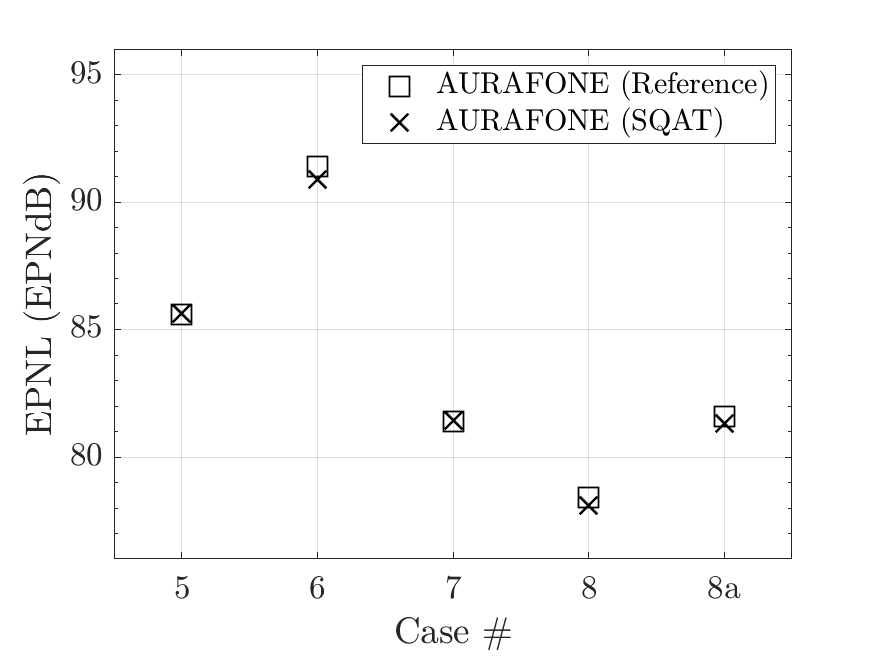

# About this code 

The `run_EPNL_cross_verification.m` code is used to perform a cross-verification between the EPNL results obtained using SQAT and EPNL values provided in the literature [1]. For this purpose, the `EPNL_FAR_Part36` function [(see code here)](../../../psychoacoustic_metrics/EPNL_FAR_Part36/EPNL_FAR_Part36.m) is used to compute the EPNL from the (auralized) audio files provided as complementary data from Ref. [1], which can be freely donwloaded from Ref. [2] <a href="https://stabserv.larc.nasa.gov/flyover/?doing_wp_cron=1703067390.0725319385528564453125" target="_blank">(link)</a>. The verification is performed considering the reference values provided in Table 4 of Ref. [1].

# How to use this code
In order to run this code and reproduce the figures available in the `figs` folder, the user needs to download the dataset of sound files from Ref. [2] <a href="https://stabserv.larc.nasa.gov/flyover/?doing_wp_cron=1703067390.0725319385528564453125" target="_blank">(link)</a>. The obtained folder called `AIAA-2020-2582_Sound_Files` has to be included in the `sound_files` folder of the toolbox (or loaded properly if the user wants to place them elsewhere).

# Results
In Ref. [1], three auralization tools, namely (1) NAF/NASA, (2) AURAFONE/Empa and (3) FLAURA/ONERA, are used to auralize 5 cases of aircraft flyovers. Therefore, the EPNL values from (5 cases X 3 tools) = 25 (auralized) aircraft flyover signals are considered.  

The figures below compare the EPNL results obtained using the `EPNL_FAR_Part36` implementation in SQAT, with the reference values provided in Table 4 of Ref. [1]. 

| NAF/NASA (Ref. [1] vs. SQAT)    | AURAFONE/Empa (Ref. [1] vs. SQAT)         |  FLAURA/ONERA (Ref. [1] vs. SQAT)      |   
| -------------- | -------------- | -------------- |
|    |   |    | 

The table below summarizes the results by presenting the absolute values from Ref. [1] along with the respective relative differences relative to the reference values **(i.e. SQAT minus Ref.)**, which are presented within [.] markers. **It is possible to verify that the highest absolute difference of results among the 25 cases considered is of about $0.6~(\mathrm{EPNdB})$.**

| Case # | NAF | AURAFONE | FLAURA |
|     :---:    |     :---:      |     :---:     | :---:     |
| 5   | 85.6 **[0.1]**     | 85.6 **[0.0]**    | 86.7 **[0.1]**    |
| 6     | 91.5 **[-0.5]**       | 91.4 **[-0.5]**      | 92.4 **[0.0]**    |
| 7     | 79.2 **[0.6]**       | 81.4 **[0.0]**      | 79.5 **[-0.1]**    |
| 8     | 80.5 **[-0.2]**       | 78.4 **[-0.3]**      | 79.0 **[0.0]**    |
| 8a     | 81.2 **[-0.2]**       | 81.6 **[-0.3]**      | 83.3 **[0.2]**   |

# References

[1] Rizzi, S. A., LeGriffon, I., Pieren, R., & Bertsch, L. (2020). A Comparison of Aircraft Flyover Auralizations by the Aircraft Noise Simulation Working Group. In AIAA AVIATION 2020 FORUM. doi: [10.2514/6.2020-2582](https://doi.org/10.2514/6.2020-2582)   

[2] [https://stabserv.larc.nasa.gov/flyover/?doing_wp_cron=1703067390.0725319385528564453125](https://stabserv.larc.nasa.gov/flyover/?doing_wp_cron=1703067390.0725319385528564453125) (Last viewed 20.12.2023)

# Log
README.md created on 20.12.2023 by Gil Felix Greco

 
