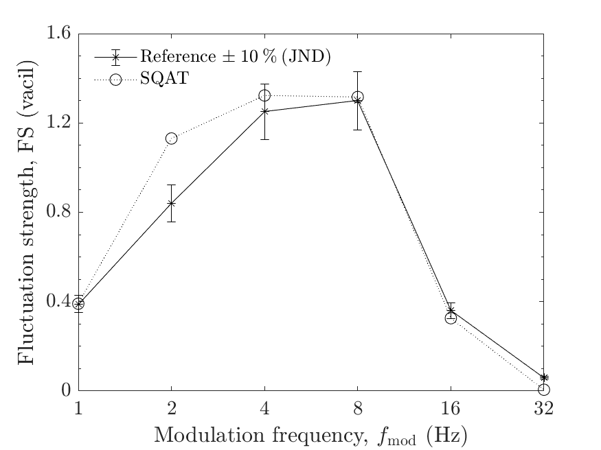

# About this code 
The `run_validation_FS_fmod.m` code is used to verify the implementation of the fluctuation strength model from Osses *et al.* [1] (see `FluctuationStrength_Osses2016` code [here](../../../psychoacoustic_metrics/FluctuationStrength_Osses2016/FluctuationStrength_Osses2016.m)). The verification is performed considering the following test signals:

- Amplitude-modulated (AM) tones with carrier frequency $f_{\mathrm{c}}=1~\mathrm{kHz}$, modulation depth $m_{\mathrm{d}}=1$, and sound pressure level $L_{\mathrm{p}}=70~\mathrm{dB}~\mathrm{SPL}$ as a function of the modulation frequency $f_{\mathrm{mod}}$.  

# How to use this code
In order to run this code and reproduce the figures available in the `figs` folder, the user needs to download the dataset of sound files from zenodo <a href="https://doi.org/10.5281/zenodo.7933206" target="_blank">here</a>. The obtained folder called `validation_SQAT_v1_0` has to be included in the `sound_files` folder of the toolbox. 

# Results
The figures below compare the results obtained using the `FluctuationStrength_Osses2016` implementation in SQAT with reference data obtained from Fastl & Zwicker [2]. The error bars express the fluctuation strength JND [2]. Results computed using SQAT correspond to time-averaged fluctuation strength values $\mathrm{FS}$.   
  

    

   

# References
[1] Osses, A., García, R., & Kohlrausch, A. (2016). Modelling the sensation of fluctuation strength. [Proceedings of Meetings on Acoustics](https://doi.org/10.1121/2.0000410), 28(1), 050005.

[2] Fastl, H., & Zwicker, E. (2007). Psychoacoustics: facts and models, Third edition. [Springer-Verlag](https://doi.org/10.1007/978-3-540-68888-4).

# Log
This code was released in SQAT v1.0, 14.05.2023

