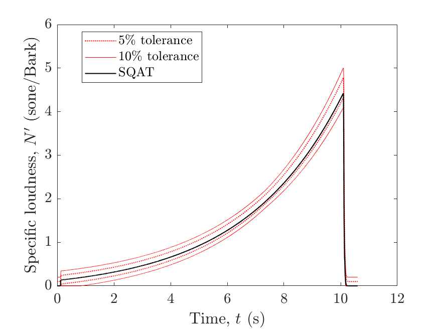
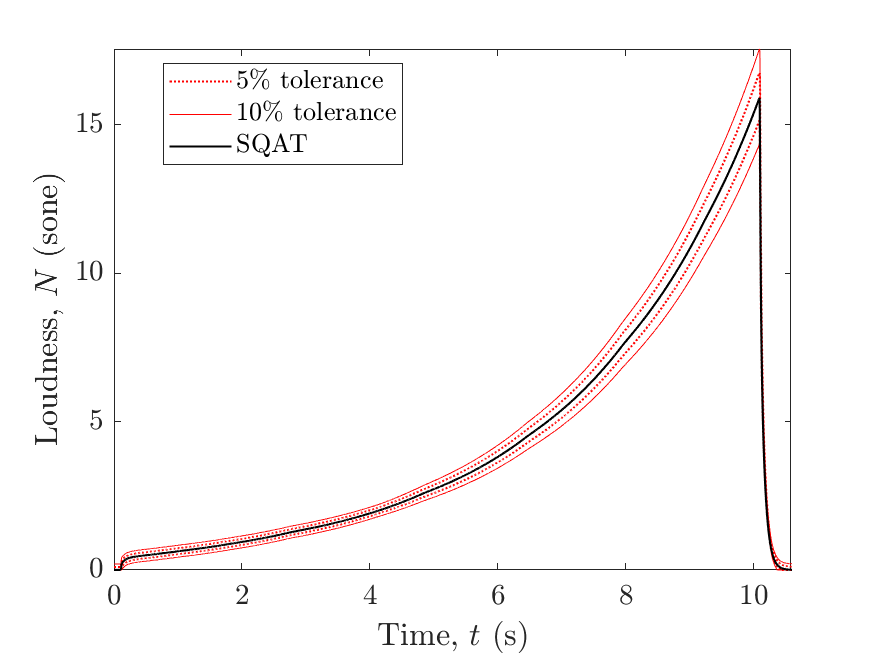
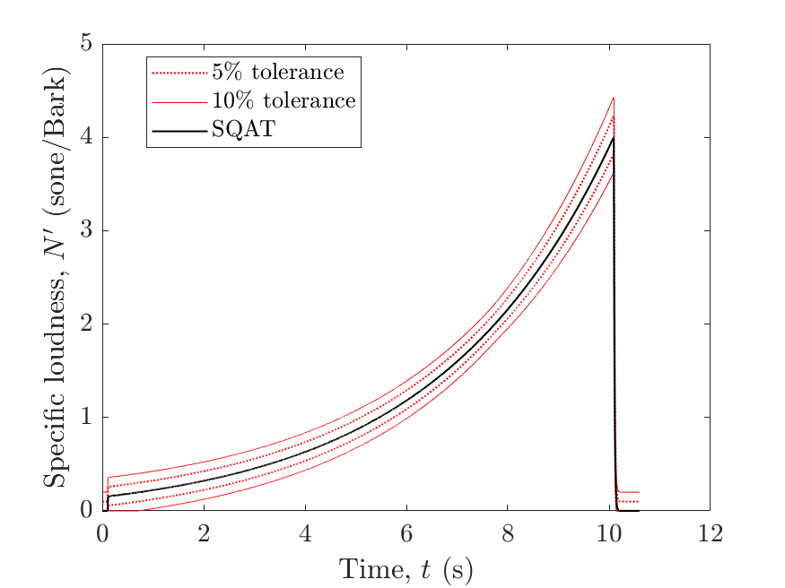
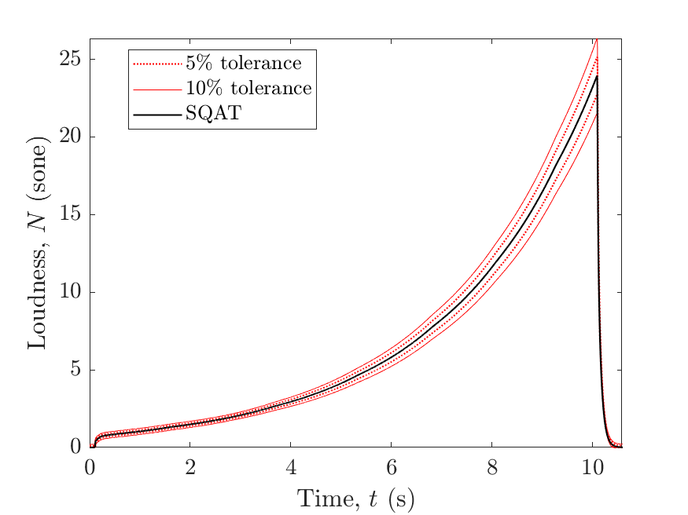
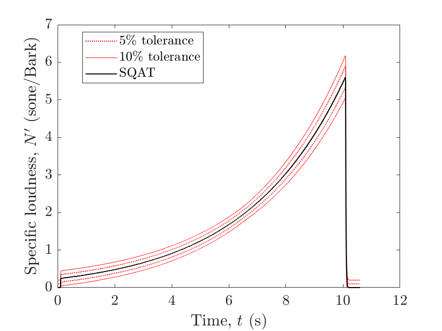
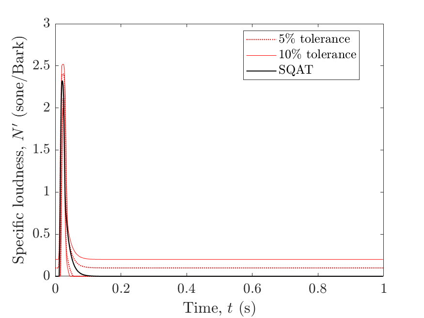
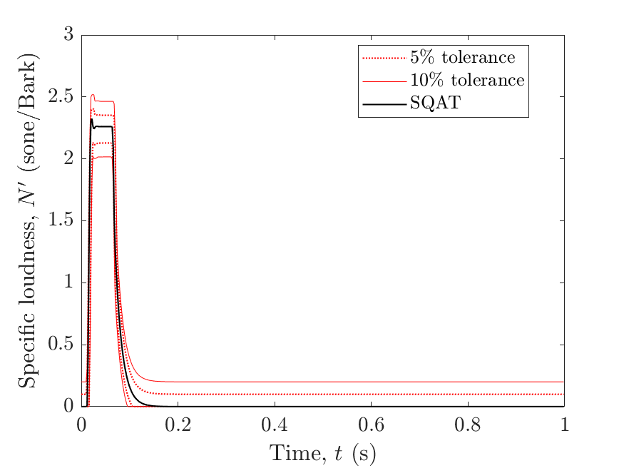
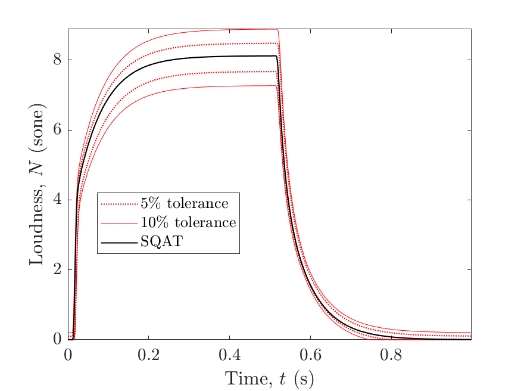
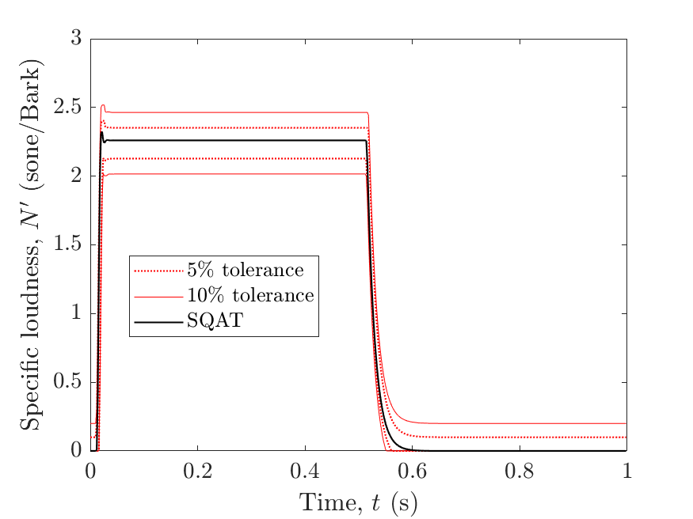
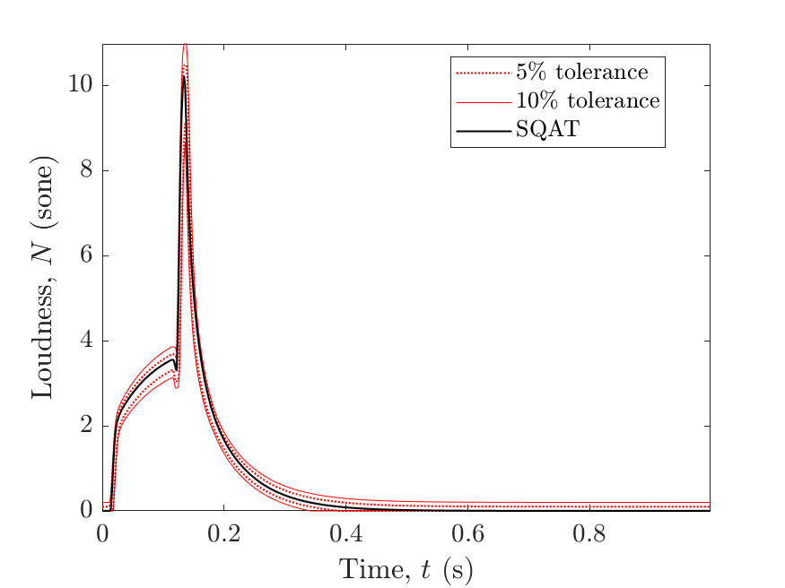

# About this code 
The `validation_stationary_loudness_synthetic_signals.m` code is used to verify the loudness implementation according to ISO 532-1 [1] (see `Loudness_ISO532_1`code [here](../../../psychoacoustic_metrics/Loudness_ISO532_1/Loudness_ISO532_1.m)). The verification of the time-varying loudness method is performed considering the synthetic test sounds provided in the Annex B.4 of the ISO standard.

# How to use this code
In order to run this code and reproduce the figures available in the `figs` folder, the user needs to download the dataset of sound files from zenodo <a href="https://doi.org/10.5281/zenodo.7933206" target="_blank">here</a>. The obtained folder called `validation_SQAT_v1_0` has to be included in the `sound_files` folder of the toolbox. 

# Results
The figures below compare the results obtained using the `Loudness_ISO532_1` implementation in SQAT with the tolerance reference values from the ISO standard. Here, the center frequency $f_{\mathrm{c}}$ and sound pressure level $L_{\mathrm{p}}$ are used to describe the signals.

| Test signal 6 (pure tone, $f_{\mathrm{c}}=250~\mathrm{Hz}$ and $L_{\mathrm{p}}=30-80~\mathrm{dB~SPL}$).    | Test signal 6 (specific loudness @ 2.5 Bark).         |
| -------------- | -------------- |
|    |   |

| Test signal 7 (pure tone, $f_{\mathrm{c}}=1~\mathrm{kHz}$ and $L_{\mathrm{p}}=30-80~\mathrm{dB~SPL}$).    | Test signal 7 (specific loudness @ 8.5 Bark).         |
| -------------- | -------------- |
|    |   |

| Test signal 8 (pure tone, $f_{\mathrm{c}}=4~\mathrm{kHz}$ and $L_{\mathrm{p}}=30-80~\mathrm{dB~SPL}$).    | Test signal 8 (specific loudness @ 17.5 Bark).         |
| -------------- | -------------- |
|    |   |

| Test signal 9 (pink noise, $L_{\mathrm{p}}=0-50~\mathrm{dB~SPL}$).    | Test signal 9 (specific loudness @ 17.5 Bark).         |
| -------------- | -------------- |
|    |   |

| Test signal 10 (10 ms tone pulse, $f_{\mathrm{c}}=1~\mathrm{kHz}$ and $L_{\mathrm{p}}=70~\mathrm{dB~SPL}$).    | Test signal 10 (specific loudness @ 8.5 Bark).         |
| -------------- | -------------- |
|    |   |

| Test signal 11 (50 ms tone pulse, $f_{\mathrm{c}}=1~\mathrm{kHz}$ and $L_{\mathrm{p}}=70~\mathrm{dB~SPL}$).    | Test signal 11 (specific loudness @ 8.5 Bark).         |
| -------------- | -------------- |
|    |   |

| Test signal 12 (500 ms tone pulse, $f_{\mathrm{c}}=1~\mathrm{kHz}$, $L_{\mathrm{p}}=70~\mathrm{dB~SPL}$).    | Test signal 12 (specific loudness @ 8.5 Bark).         |
| -------------- | -------------- |
|    |   |

| Test signal 13 (Combined tone pulses, $f_{\mathrm{c}}=1~\mathrm{kHz}$).    | Test signal 13 (specific loudness @ 8.5 Bark).         |
| -------------- | -------------- |
|    |   |

# References
[1]  International Organization for Standardization. (2017). Acoustics - Methods for calculating loudness - Part 1: Zwicker method (ISO Standard No. 532-1).

# Log
This code was released in SQAT v1.0, 14.05.2023

