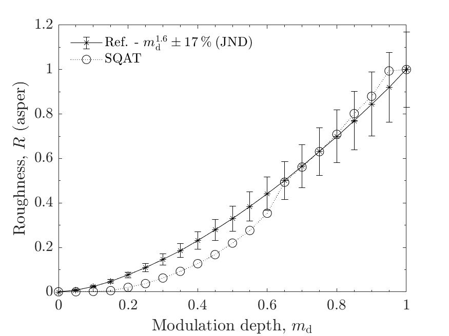

# About this code 
The `run_verification_roughness_modulation_depth.m` code is used to verify the `Roughness_Daniel1997` implementation (see code [here](../../../../psychoacoustic_metrics/Roughness_Daniel1997/Roughness_Daniel1997.m)) of the roughness model from Daniel & Weber [1]. The verification is performed considering amplitude-modulated tones with carrier frequency $f_{\mathrm{c}}=1000~\mathrm{Hz}$, modulation frequency $f_{\mathrm{mod}}=70~\mathrm{Hz}$ and sound pressure level $L_{\mathrm{p}}=60~\mathrm{dB}~\mathrm{SPL}$ as a function of the modulation depth $m_{\mathrm{d}}$.  

# How to use this code
In order to run this code and reproduce the figures available in the `figs` folder, the user needs to download the dataset of sound files from zenodo <a href="https://doi.org/10.5281/zenodo.7933206" target="_blank">here</a>. The obtained folder called `validation_SQAT_v1_0` has to be included in the `sound_files` folder of the toolbox. 

# Results
The figure below compares the results obtained using the `Roughness_Daniel1997` implementation in SQAT with the power law suggested Fastl & Zwicker [1]. The error bars express the roughness JND also reported in [1]. Results computed using SQAT correspond to the time-averaged roughness $R$.   

   

# References
[1] Fastl, H. & Zwicker, Z. (2007). Psychoacoustics: facts and models, Third edition. [Springer-Verlag](https://doi.org/10.1007/978-3-540-68888-4).

# Log
This code was released in SQAT v1.0, 14.05.2023

