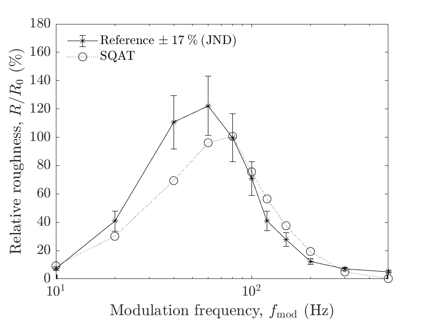

# About this code 
The `run_validation_roughness_FM_fmod.m` code is used to verify the implementation of the roughness model from Daniel & Weber [1] (see `Roughness_Daniel1997` code [here](../../../psychoacoustic_metrics/Roughness_Daniel1997/Roughness_Daniel1997.m)). The verification is performed considering frequency-modulated (FM) tones with carrier frequency $f_{\mathrm{c}}=1.6~\mathrm{kHz}$, frequency deviation $f_{\mathrm{dev}}=\pm800~\mathrm{Hz}$ and sound pressure level $L_{\mathrm{p}}=60~\mathrm{dB}~ \mathrm{SPL}$ as a function of the modulation frequency $f_{\mathrm{mod}}$. The reference is the roughness $R_o$ of a FM tone with the same parameters but a modulation frequency $f_{\mathrm{mod}}=70~\mathrm{Hz}$.  

# How to use this code
In order to run this code and reproduce the figures available in the `figs` folder, the user needs to download the dataset of sound files from zenodo <a href="https://doi.org/10.5281/zenodo.7933206" target="_blank">here</a>. The obtained folder called `validation_SQAT_v1_0` has to be included in the `sound_files` folder of the toolbox. 

# Results
The figure below compares the results obtained using the `Roughness_Daniel1997` implementation in SQAT  with reference data obtained from listening tests [1]. The error bars express the roughness JND [2]. Results computed using SQAT correspond to time-averaged roughness values $R$.   

FM tones ($f_{\mathrm{c}}=1.6~\mathrm{kHz}$, $f_{\mathrm{dev}}=\pm800~\mathrm{Hz}$ and $L_{\mathrm{p}}=60~\mathrm{dB}~\mathrm{SPL}$).        |  
:-------------------------:|
   

# References
[1] Daniel, P., & Weber, R. (1997). Psychoacoustical Roughness: Implementation of an Optimized Model. [Acta Acustica united with Acustica](https://www.ingentaconnect.com/content/dav/aaua/1997/00000083/00000001/art00020), 83(1), 113-123.

[2] Fastl, H., & Zwicker, Z. (2007). Psychoacoustics: facts and models, Third edition. [Springer-Verlag](https://doi.org/10.1007/978-3-540-68888-4).

# Log
This code was released in SQAT v1.0, 14.05.2023

