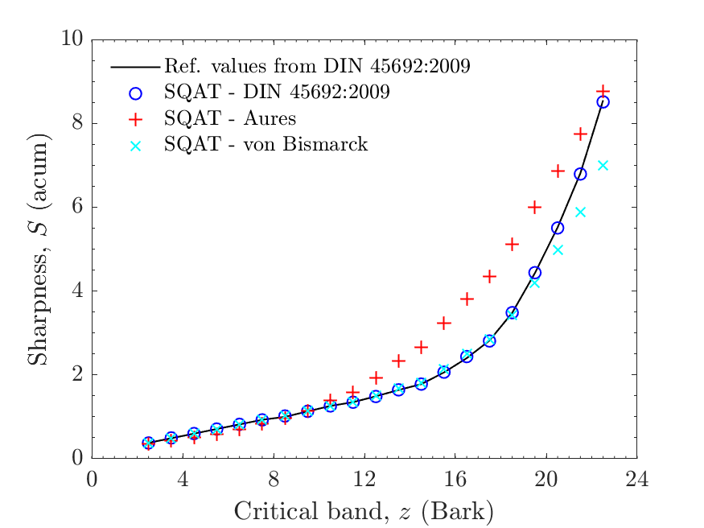
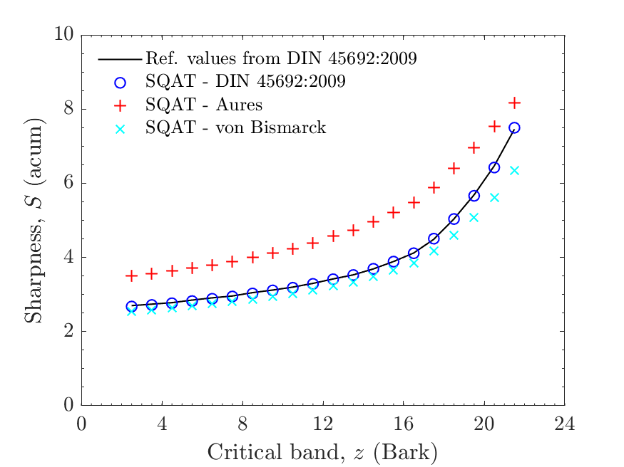

# Sharpness according to DIN 45692: verification of the implementation in SQAT 
The `validation_Sharpness_DIN45692_narrowband_and_broadband_signals.m` code is used to verify the sharpness implementation according to DIN 45692 [1] (see `Sharpness_DIN45692`code [here](../../psychoacoustic_metrics/Sharpness_DIN45692/Sharpness_DIN45692.m)). The verification is performed considering test signals as specified by the DIN norm, which consist of: 

- 21 narrowband sounds (one-critical-band wide) with center frequencies in Bark (from $2.5~\mathrm{Bark}$ to $22.5~\mathrm{Bark}$ in $1~\mathrm{Bark}$ steps), and
- 21 broadband sounds with variable lower frequencies in Bark (from $2.5~\mathrm{Bark}$ to $22.5~\mathrm{Bark}$ in $1~\mathrm{Bark}$ steps) and fixed upper frequency of $10~\mathrm{kHz}$ ($\approx 22.4~\mathrm{Bark}$). 

All test signals are stationary noises with a total loudness of $4~\mathrm{sone}$.

# How to use this code
In order to run this code and reproduce the figures available in the `figs` folder, the user needs to download the dataset of sound files from zenodo <a href="https://doi.org/10.5281/zenodo.7933206" target="_blank">here</a>. The obtained folder called `validation_SQAT_v1_0` has to be included in the `sound_files` folder of the toolbox. 

# Results
The figures below compare the results obtained using the `Sharpness_DIN45692` implementation in SQAT with reference values from the DIN norm [1]. The DIN norm stipulates a maximum tolerance of 0.05 acum from the provided reference values. The loudness of the test signals is obtained using the loudness method for stationary signals according to ISO 532-1 [2], as implemented in SQAT (see `Loudness_ISO532_1` [here](../../psychoacoustic_metrics/Loudness_ISO532_1/Loudness_ISO532_1.m)).
  
Absolute values |  Relative error 
 | -------------- | -------------- |
|        |      |

# Comparison of weighting functions
The DIN standard [1] defines three weighting functions for the calculation of sharpness. The standard weighting function $g(z)$ (also called the DIN 45692 weighting function) is based on the work of Widmann [3]. The two additional weighting functions $g_{\mathrm{B}}(z)$ and $g_{\mathrm{A}}(z)$ were developed by von Bismarck [4] and Aures [5], respectively. 

As the sharpness results may significantly differ depending on the weighting function and the test signals, it is recommended to adequately report the method used for the sake of clarity. This is also the case for the method used to compute the loudness. Moreover, the selection of the weighting function has to be carefully made depending on the test sounds. The level-independent weighting functions $g(z)$ and $g_{\mathrm{B}}(z)$ are recommended if the sounds to be compared have similar loudness. The weighting function $g_{\mathrm{A}}(z)$ accounts for the influence of the total loudness and is thus recommended if the test sounds have a significant loudness difference [6]. 

The figure below presents a comparison of sharpness values obtained using the three different weighting functions. The results are obtained using the `Sharpness_DIN45692` implementation in SQAT and the narrowband and broadband test signals specified by the DIN standard [1]. 

Narrowband signals |  Broadband signals 
 | -------------- | -------------- |
|        |      |

# References
[1] Deutsches Institut für Normung. (2009). Measurement technique for the simulation of the auditory sensation of sharpness (DIN Standard No. 45692).

[2] International Organization for Standardization. (2017). Acoustics - Methods for calculating loudness - Part 1: Zwicker method (ISO Standard No. 532-1).

[3] Widmann, U. (1993). Untersuchungen zur Schärfe und zur Lästigkeit von Rauschen unterschiedlicher Spektralverteilung, DAGA 93, S. 644-647.

[4] von Bismarck, G. (1974). Sharpness as an Attribute of the Timbre of Steady Sounds. [Acta Acustica united with Acustica](https://www.ingentaconnect.com/content/dav/aaua/1974/00000030/00000003/art00006), 30(3), 159-172.

[5] Aures, W. (1985). Berechnungsverfahren für den sensorischen Wohlklang beliebiger Schallsignale (A model for calculating the sensory euphony of various sounds). [Acta Acustica united with Acustica](https://www.ingentaconnect.com/content/dav/aaua/1985/00000059/00000002/art00008), 59(2), 130-141.

[6] Head acoustics. (2018). Psychoacoustic analyses I, Application note. [https://cdn.head-acoustics.com/fileadmin/data/global/Application-Notes/SVP/Psychoacoustic-Analyses-I-02.2018.pdf](https://cdn.head-acoustics.com/fileadmin/data/global/Application-Notes/SVP/Psychoacoustic-Analyses-I-02.2018.pdf) (Last viewed: May 25, 2023)

# Log
This code was released in SQAT v1.0, 14.05.2023

