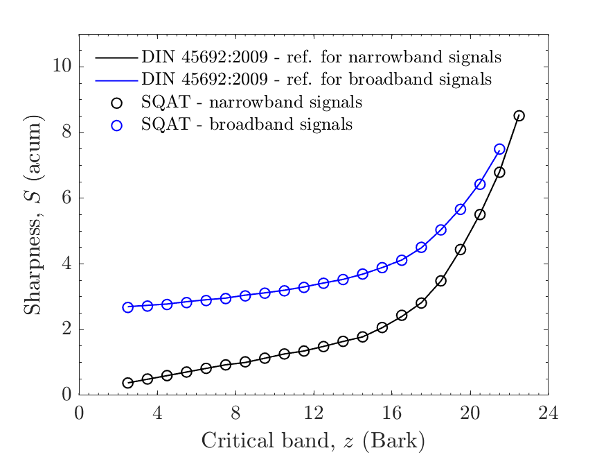

# Sharpness according to DIN 45692: verification of the implementation in SQAT 
The `validation_Sharpness_DIN45692_narrowband_and_broadband_signals.m` code is used to verify the sharpness implementation according to DIN 45692 [1] (see `Sharpness_DIN45692`code [here](../../psychoacoustic_metrics/Sharpness_DIN45692/Sharpness_DIN45692.m)). The verification is performed considering test signals as specified by the DIN norm, which comprise: 

- 21 narrowband sounds (one-critical-band wide) with center frequencies in Bark (from $2.5~\mathrm{Bark}$ to $22.5~\mathrm{Bark}$ in $1~\mathrm{Bark}$ steps), and
- 21 broadband sounds with variable lower frequencies in Bark (from $2.5~\mathrm{Bark}$ to $22.5~\mathrm{Bark}$ in $1~\mathrm{Bark}$ steps) and fixed upper frequency of $10~\mathrm{kHz}$ ($\approx 22.4~\mathrm{Bark}$). 

All test signals are stationary noises with a total loudness of $4~\mathrm{sone}$.

# How to use this code
In order to run this code and reproduce the figures available in the `figs` folder, the user needs to download the dataset of sound files from zenodo <a href="https://doi.org/10.5281/zenodo.7933206" target="_blank">here</a>. The obtained folder called `validation_SQAT_v1_0` has to be included in the `sound_files` folder of the toolbox. 

# Results
The figures below compare the results obtained using the `Sharpness_DIN45692` implementation in SQAT with reference values from the DIN norm [1]. The DIN norm stipulates a maximum tolerance of 0.05 acum from the provided reference values. The loudness of the test signals is obtained using the loudness method for stationary signals according to ISO 532-1 [2], as implemented in SQAT (see `Loudness_ISO532_1` [here](../../psychoacoustic_metrics/Loudness_ISO532_1/Loudness_ISO532_1.m)).
  
Absolute values |  Relative error 
 | -------------- | -------------- |
|        |      |

# References
[1] Deutsches Institut für Normung. (2009). Measurement technique for the simulation of the auditory sensation of sharpness (DIN Standard No. 45692).

[2] International Organization for Standardization. (2017). Acoustics - Methods for calculating loudness - Part 1: Zwicker method (ISO Standard No. 532-1).

# Log
This code was released in SQAT v1.0, 14.05.2023

